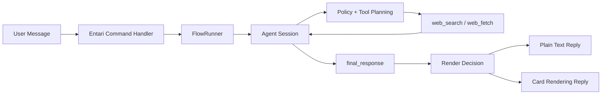

# 10_15 Workspace

**English** | [简体中文](README.zh-CN.md)

A monorepo for three Entari-related projects.

Current focus is **`entari-plugin-hyw`**. The other two projects are still under development and are **not ready for production use**.

## Project Status

| Project | Path | Status | Notes |
| --- | --- | --- | --- |
| `entari-plugin-hyw` | `src/entari_plugin_hyw` | Usable (active development) | Main plugin in this repo. |
| `hyw-desktop` | `src/hyw_desktop` | In development (not usable) | Desktop UI/Tauri client, incomplete. |
| `entari-plugin-codex` | `src/entari_plugin_codex` | In development (not usable) | Codex integration plugin, incomplete. |

## Main Project: entari-plugin-hyw

`entari-plugin-hyw` is an Entari plugin for chat-oriented agent workflows in IM environments.

### What It Can Do Today

- Multi-turn chat by replying to the bot message.
- Mixed text + image input (image context is passed into the agent flow).
- Web search through DuckDuckGo Lite (`web_search`) with optional region filter (`kl`) and time filter (`d/w/m/y`).
- Structured response generation with optional Markdown card rendering.
- Conversation and tool trace logging for debugging (`logs/conversations`).

### Architecture (Current Design)



### Configuration (`entari.yml`)

Use `plugins.entari_plugin_hyw`:

```yaml
plugins:
  entari_plugin_hyw:
    question_command: "/q"
    quote: false
    theme_color: "#ef4444"

    api_key: "YOUR_API_KEY"
    base_url: "https://openrouter.ai/api/v1"
    model_name: "gpt-4o"
    temperature: 0.5
```

### Search Behavior Notes

- The model is instructed to output `time_range` codes: `a/d/w/m/y`.
- Runtime strips unsupported/empty filters before hitting DuckDuckGo.
- For freshness checks, at least one query should use `d` or `w`.
- Region locking (`kl`) is optional; use it when locality is known and precision matters.

## Quick Start (Workspace)

```bash
uv sync --dev
```

Then configure `entari.yml` and start Entari using your normal runtime command.

## Additional Docs

- Chinese workspace README: [README.zh-CN.md](README.zh-CN.md)
- LLM operation guide (EN): [docs/README_LLM_EN.md](docs/README_LLM_EN.md)
- LLM operation guide (ZH): [docs/README_LLM_CN.md](docs/README_LLM_CN.md)
- Legacy Chinese entry (redirect): [docs/README_CN.md](docs/README_CN.md)

## License

MIT
