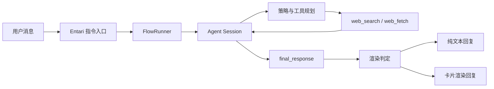

# 10_15 工作区

[English](README.md) | **简体中文**

这是一个包含三个 Entari 相关项目的 monorepo。

当前仓库重点是 **`entari-plugin-hyw`**。另外两个项目仍在开发中，**暂不可用**。

## 项目状态

| 项目 | 路径 | 状态 | 说明 |
| --- | --- | --- | --- |
| `entari-plugin-hyw` | `src/entari_plugin_hyw` | 可用（持续开发） | 本仓库主项目。 |
| `hyw-desktop` | `src/hyw_desktop` | 开发中（不可用） | 桌面端/Tauri 客户端，尚未完成。 |
| `entari-plugin-codex` | `src/entari_plugin_codex` | 开发中（不可用） | Codex 集成插件，尚未完成。 |

## 主项目：entari-plugin-hyw

`entari-plugin-hyw` 是一个面向即时通讯场景的 Entari 智能体插件。

### 目前已能完成

- 通过回复机器人消息进行多轮对话。
- 支持图文混合输入（图片上下文会进入 Agent 流程）。
- 通过 DuckDuckGo Lite 执行网页检索（`web_search`），支持地区参数 `kl` 和时间参数 `d/w/m/y`。
- 结构化生成回复，并按内容复杂度决定是否渲染为卡片图。
- 自动记录调试日志与工具轨迹（`logs/conversations`）。

### 架构设计（当前实现）



### 配置说明（`entari.yml`）

配置路径：`plugins.entari_plugin_hyw`

```yaml
plugins:
  entari_plugin_hyw:
    question_command: "/q"
    quote: false
    theme_color: "#ef4444"

    api_key: "YOUR_API_KEY"
    base_url: "https://openrouter.ai/api/v1"
    model_name: "gpt-4o"
    temperature: 0.5
```

### 检索策略补充

- 模型侧要求 `time_range` 输出代码：`a/d/w/m/y`。
- 运行时会在发起 DuckDuckGo 请求前去掉无效/空时间过滤。
- 需要时效验证时，至少一条检索应使用 `d` 或 `w`。
- 地区参数 `kl` 默认可不填；已知目标地区时再锁定可提升精度。

## 工作区快速开始

```bash
uv sync --dev
```

然后修改 `entari.yml`，使用你平时的 Entari 启动方式运行。

## 相关文档

- 英文主文档：[README.md](README.md)
- LLM 操作说明（英文）：[docs/README_LLM_EN.md](docs/README_LLM_EN.md)
- LLM 操作说明（中文）：[docs/README_LLM_CN.md](docs/README_LLM_CN.md)
- 旧中文入口（跳转说明）：[docs/README_CN.md](docs/README_CN.md)

## 许可证

MIT
