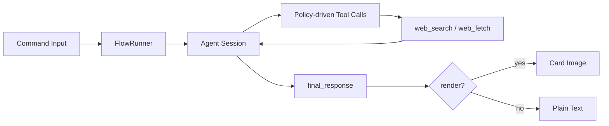

# entari-plugin-hyw

[简体中文](README.zh-CN.md)

An Entari plugin for chat-oriented agent workflows.

## Status

Usable and under active development.

## What It Does

- Chat Q&A command entry (`question_command`, default `/q`).
- Reply-based multi-turn continuation.
- Optional image context ingestion.
- Web search tool integration (`web_search`) with time and region controls.
- Optional card-style rendering for Markdown-heavy outputs.

## Architecture



## Configuration

Configure `plugins.entari_plugin_hyw` in `entari.yml`:

```yaml
plugins:
  entari_plugin_hyw:
    question_command: "/q"
    web_command: "/w"
    headless: false
    quote: false
    theme_color: "#ef4444"

    api_key: "YOUR_API_KEY"
    base_url: "https://openrouter.ai/api/v1"
    model_name: "gpt-4o"
    temperature: 0.5
```

| Key | Default | Notes |
| --- | --- | --- |
| `api_key` | `null` | LLM API key. |
| `base_url` | `https://openrouter.ai/api/v1` | LLM endpoint root. |
| `model_name` | `gpt-4o` | Main model ID. |
| `temperature` | `0.5` | Sampling temperature. |
| `question_command` | `/q` | Main command trigger. |
| `web_command` | `/w` | Reserved field; currently not wired to a separate handler. |
| `headless` | `false` | Browser/render headless mode. |
| `quote` | `false` | Reply with quote context. |
| `theme_color` | `#ef4444` | Rendered card accent color. |

## Search Policy Notes

- Model-side `time_range` convention: `a/d/w/m/y`.
- Runtime strips unsupported filters before request.
- At least one query should use `d` or `w` for freshness checks when searching.
- `kl` is optional; set only when region precision is needed.

## License

MIT
