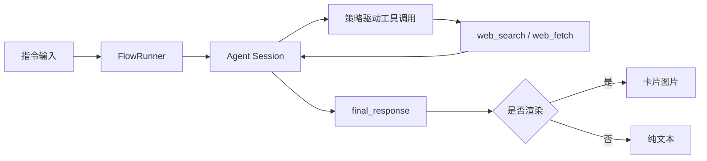

# entari-plugin-hyw

[English](README.md)

面向聊天场景的 Entari 智能体插件。

## 状态

可用，且持续开发中。

## 当前能力

- 指令问答入口（`question_command`，默认 `/q`）。
- 支持通过回复机器人消息进行多轮对话。
- 支持图片上下文输入。
- 集成网页检索工具（`web_search`），支持时间/地区筛选。
- 对复杂 Markdown 输出可渲染为卡片图。

## 架构



## 配置

在 `entari.yml` 中配置 `plugins.entari_plugin_hyw`：

```yaml
plugins:
  entari_plugin_hyw:
    question_command: "/q"
    web_command: "/w"
    headless: false
    quote: false
    theme_color: "#ef4444"

    api_key: "YOUR_API_KEY"
    base_url: "https://openrouter.ai/api/v1"
    model_name: "gpt-4o"
    temperature: 0.5
```

| 配置项 | 默认值 | 说明 |
| --- | --- | --- |
| `api_key` | `null` | LLM API Key。 |
| `base_url` | `https://openrouter.ai/api/v1` | LLM 接口根地址。 |
| `model_name` | `gpt-4o` | 主模型 ID。 |
| `temperature` | `0.5` | 采样温度。 |
| `question_command` | `/q` | 主问答指令。 |
| `web_command` | `/w` | 预留字段，目前未绑定独立处理。 |
| `headless` | `false` | 浏览器/渲染无头模式。 |
| `quote` | `false` | 回复时是否引用上下文。 |
| `theme_color` | `#ef4444` | 卡片主题色。 |

## 检索策略补充

- 模型侧 `time_range` 约定：`a/d/w/m/y`。
- 运行时会过滤无效时间参数后再请求。
- 进行检索时，建议至少一条使用 `d` 或 `w` 做时效校验。
- `kl` 通常不填，地区强相关问题再加。

## 许可证

MIT
